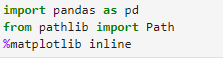
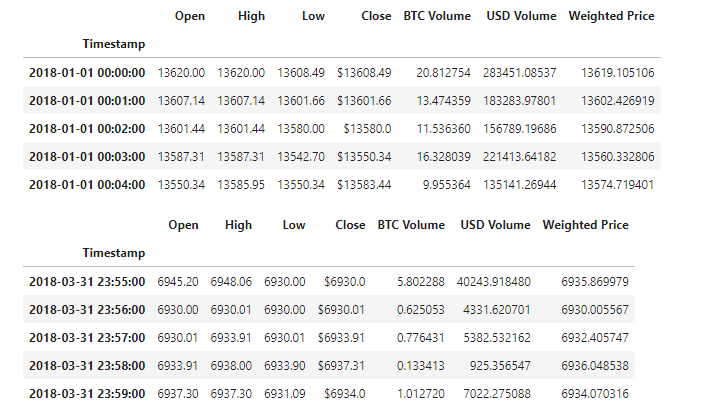
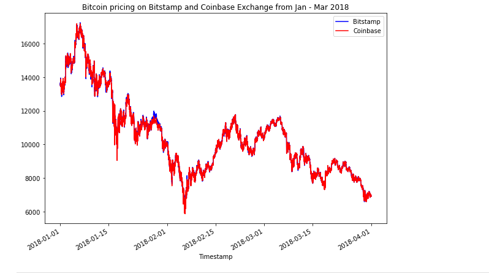
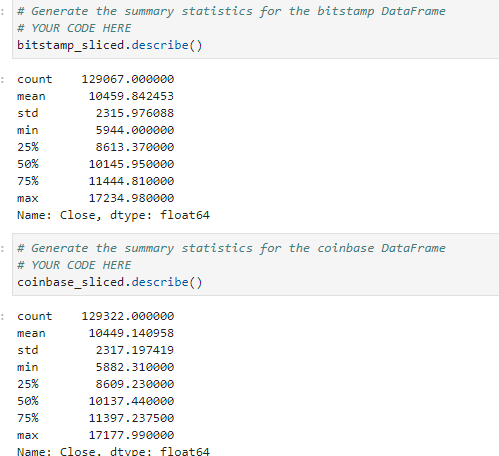
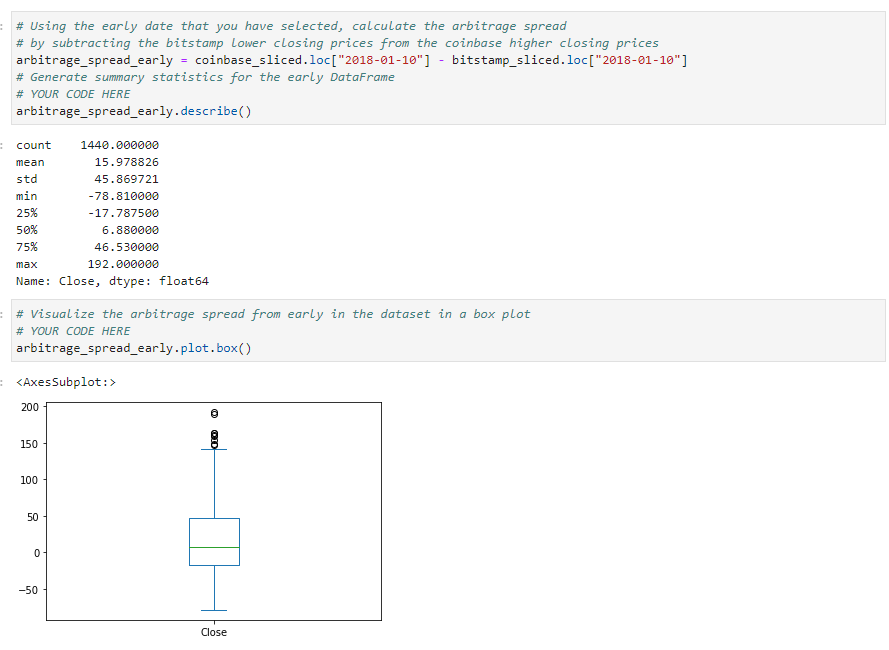
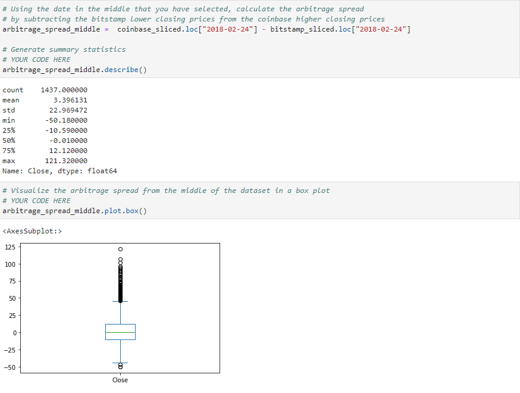
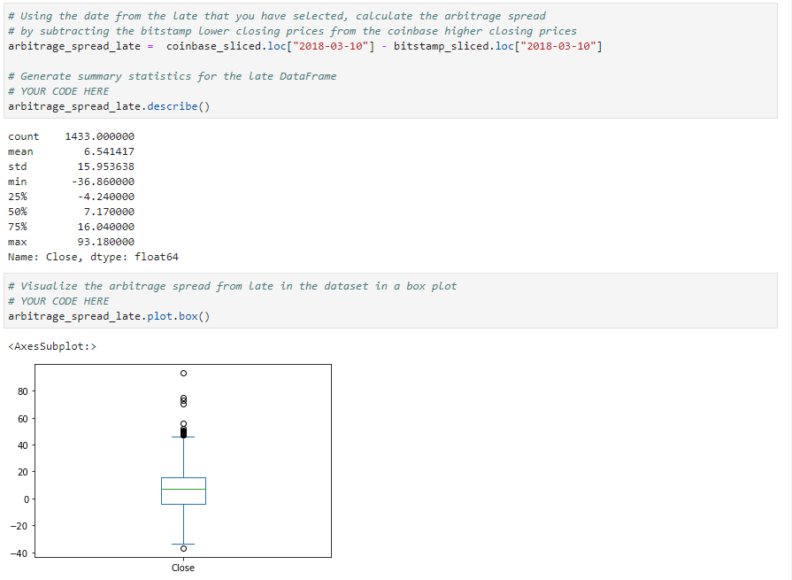
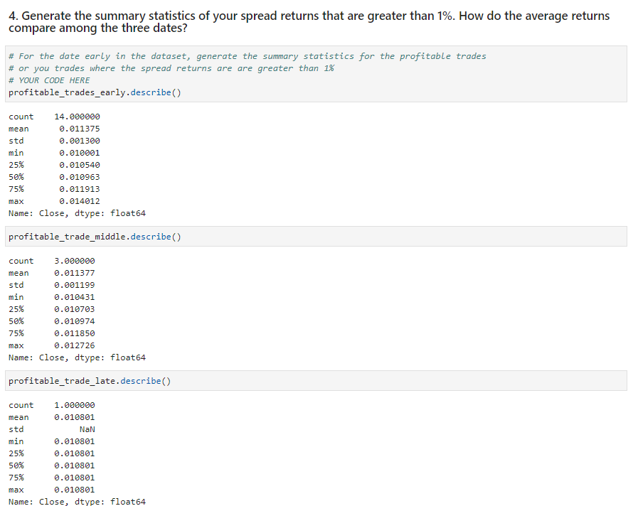
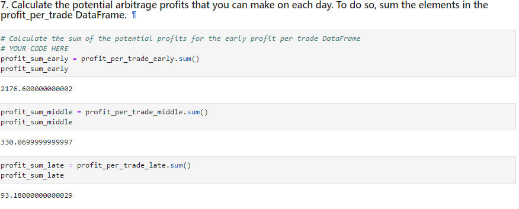

# Challenge_3_Crypto_Arbitrage_Analysis
This project is an analysis to determine if any arbitrage opportunites existed for Bitcoin on the Bitstamp and Coinbase Exchanges. A small historial sample (2018-01-01:2018-03-31) was used for the analysis. The "Break Down of Analysis" section below will provide more details on the analysis that was performed. For the full analysis please refer to the JupyterLab NoteBook ("crpto_arbitage") attached in the Starter_Code direcotry. 

Below is a link for more information about Arbitrage:
 
 >[Arbitrage](https://www.investopedia.com/terms/a/arbitrage.asp#:~:text=The%20standard%20definition%20of%20arbitrage%20involves%20buying%20and,also%20sometimes%20used%20to%20describe%20other%20trading%20activities.)

---
## Technologies
The programming language used for this analysis was **Python (v 3.9.7)**.

The applicable libraries needed to run this analysis are:

>

---

## Installation Guide

All of the above libraries should be part of the base applications that were installed with the Python version above; if not, you will have to install them through the pip package manager of Python.

---

## Contributors

James Handral
james.handral@gmail.com

---

## License

N/A

---

## Break Down of Analysis

1- Data Collection:

The historical Bitcoin price data from the Bitstamp and Coinbase Exchanges from 2018-01-01 through 2018-03-31 were imported for the arbritrage analysis.

2- Summary Statistics and Plot of the 2 Exchanges from Jan 2018 - March 2018:

The summary statistics shows on a high level the 2 Exchanges had disparaties between the prices that were being offered for Bitcoin from Jan 2018 to March 2018. But they weren't substaintial based on the small differences of the mean, max, and min amounts of the 2 Exchanges summary statistics compared to each other (shown below). The 2 exchanges were plotted together on the same chart and confirms there were only small differences between the Bitcoin prices from Jan 2018 through March 2018: 

 

3- Analysis on Specific dates from Jan 2018 - March 2018:

Based on the above overlay plot of the 2 exchanges 3 dates were selected from the 1st quarter of 2018 that seem to offer potential arbitrage opportunities. The summary statistics and the Box plot of the 3 dates selected shows a decrease of the standard deviation, which suggest a decrease in arbitrage opportunites in the later dates of the 1st quarter of 2018 of Bitcoin prices from the Bitstamp and Coinbase Exchanges:

4- Calculate the Arbitrage Profits:

Based on the 3 dates selected a filtering process was performed on the arbitrage data set for those dates to find the spreads greater than 1% (to cover transaction cost) to calculate the potential profits for those dates. Please note the spreads that were greater than 1% decreased each selected date which coincided with a decrease in profits; Reference calculation below:

In conclusion, the data suggest that the opportunites for arbitrage transactions between the 2 exchanges were greater in the beginning of the period and slowly diminished while time progressed and more individuals took advantage of the arbitrage opportunites.

---
**Link to Analysis**

[crypto_arbitrage](./Starter_Code(2)/Starter_Code/crypto_arbitrage.ipynb)

